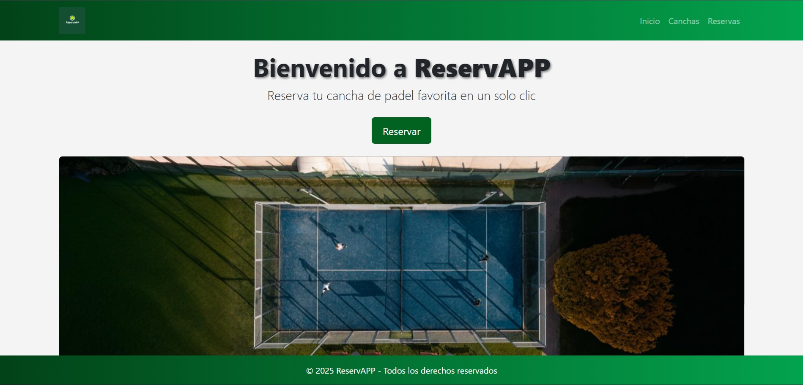
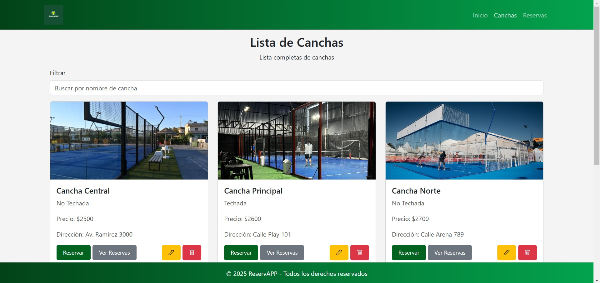
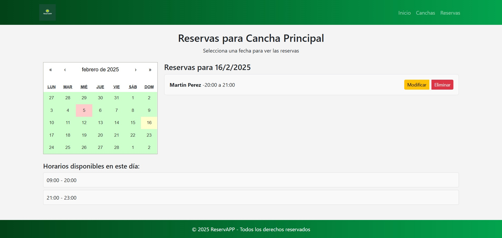
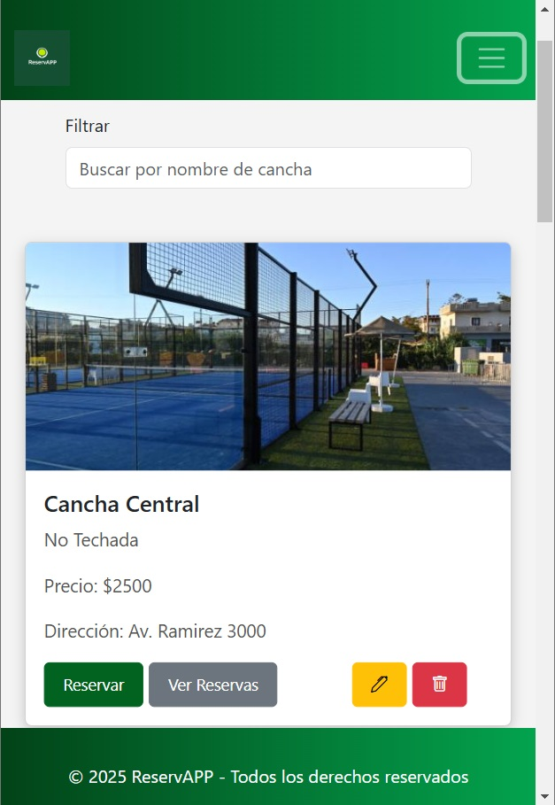

# � ReservAPP - Frontend ✨


## 📖 Descripción

**ReservAPP Frontend** es la interfaz moderna y reactiva para gestionar reservas de pádel 🎾, diseñada para ofrecer:

- 🖥️ **Experiencia de usuario fluida** con React 18+
- 📱 **Diseño 100% responsivo** (mobile-first)
- 🔄 **Comunicación en tiempo real** con el backend
- 🚀 **Despliegue automático** con GitHub Pages

🔗 **Backend disponible aquí**: [ReservAPP Backend](https://github.com/tu_usuario/tu_repositorio_backend) (FastAPI + PostgreSQL)

---

## ✨ Características Principales

- 🎨 **UI moderna** con animaciones fluidas
- 📅 **Calendario interactivo** de reservas
- 🔍 **Búsqueda inteligente** de disponibilidad

---

## 🛠️ Tecnologías Utilizadas

| Categoría       | Tecnologías                                                                 |
|-----------------|-----------------------------------------------------------------------------|
| **Core**        | React 18, Vite, JavaScript ES6+                                             |
| **Estilos**     | Tailwind CSS, PostCSS, Animate.css                                          |
| **Estado**      | Context API + Redux                                                         |
| **Routing**     | React Router v6                                                             |
| **HTTP Client** | Axios                                                                       |
| **Formularios** | React Hook Form                                                             |
| **Deploy**      | GitHub Pages, gh-pages                                                      |

---

## 🚀 Próximas Actualizaciones (Roadmap)

- 🌙 **Modo oscuro** automático
- 📊 **Dashboard admin** con gráficos
- 🔔 **Notificaciones push** en navegador
- 📱 **App nativa** (con Capacitor.js)
- ⚡ **Optimización** (lazy loading + suspense)

---

# Capturas de Pantalla


*Pantalla principal de la aplicación*


*Listado para ver las canchas*


*Pantalla para ver las reservas de una cancha*


*Vista responsive*

---

## ⚙️ Instalación Local

1. **Clonar el repositorio**
   ```bash
   git clone https://github.com/Brian13b/ReservAPP-frontend.git
   cd ReservAPP-frontend
   ```

2. Instala las dependencias:

   ```bash
   npm install
   ```

3. Inicia el servidor de desarrollo:

   ```bash
   npm run dev
   ```

4. Accede a la aplicación en: [http://localhost:3000](http://localhost:3000)

---

## Despliegue en GitHub Pages

1. Configura el repositorio para desplegar en GitHub Pages:

   - Asegúrate de tener el campo `homepage` configurado en `package.json`, por ejemplo:
     ```json
     "homepage": "https://Brian13b.github.io/ReservAPP-frontend",
      "scripts": {
         "predeploy": "npm run build",
         "deploy": "gh-pages -d dist"
      }
     ```

2. Despliega en GitHub Pages usando `gh-pages`:

   ```bash
   npm install --save-dev gh-pages
   npm run deploy
   ```

---

## 🤝 Contribución

Si deseas contribuir a este proyecto:

1. 🍴 Realiza un fork del repositorio.
2. 🌿 Crea una rama para tu nueva funcionalidad: `git checkout -b feature/nueva-funcionalidad`
3. 💾 Realiza los cambios y realiza un commit: `git commit -m 'Agrega nueva funcionalidad'`
4. 🚀 Sube tus cambios a tu fork: `git push origin feature/nueva-funcionalidad`
5. 🔄 Crea un pull request en este repositorio.

---

## Licencia

Este proyecto está bajo la Licencia MIT. Consulta el archivo [LICENSE](LICENSE) para más detalles.

---

## Contacto

Si tienes preguntas o sugerencias, no dudes en contactarnos a través de [brian.nbattauz@gmail.com](mailto\:brian.nbattauz@gmail.com)..

